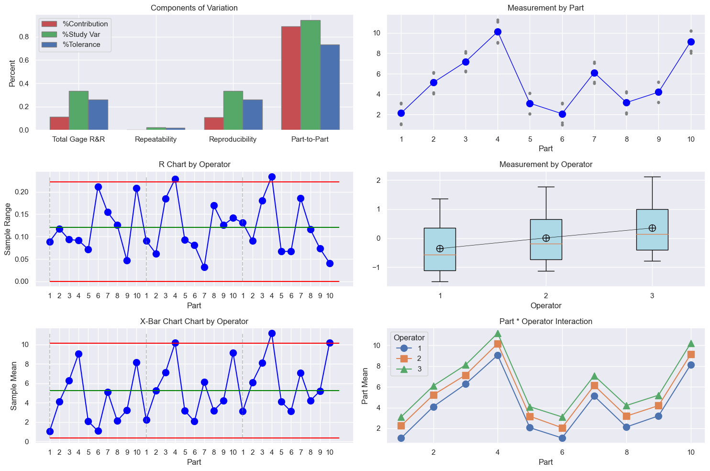

<h1> PyGRR: Gage R&R in Python</h1>
The following code demonstrates usage of this package


```python
import pyGRR
import GRRPlots
from matplotlib import pyplot as plt
```


```python
myData = pyGRR.read_grr_data('C:/users/ryanp/downloads/grr_wksht_3.xlsx')
myGRR = pyGRR.GRR(myData)
myGRR.ANOVA_Table()
```


<div>
<style scoped>
    .dataframe tbody tr th:only-of-type {
        vertical-align: middle;
    }

    .dataframe tbody tr th {
        vertical-align: top;
    }

    .dataframe thead th {
        text-align: right;
    }
</style>
<table border="1" class="dataframe">
  <thead>
    <tr style="text-align: right;">
      <th></th>
      <th>Source</th>
      <th>DF</th>
      <th>SS</th>
      <th>MS</th>
      <th>F</th>
      <th>p</th>
    </tr>
  </thead>
  <tbody>
    <tr>
      <th>0</th>
      <td>Part</td>
      <td>9</td>
      <td>659.786390</td>
      <td>73.309599</td>
      <td>7640.426794</td>
      <td>0.0</td>
    </tr>
    <tr>
      <th>1</th>
      <td>Operator</td>
      <td>2</td>
      <td>60.961934</td>
      <td>30.480967</td>
      <td>3176.768113</td>
      <td>0.0</td>
    </tr>
    <tr>
      <th>2</th>
      <td>Part * Operator</td>
      <td>18</td>
      <td>0.172709</td>
      <td>0.009595</td>
      <td>1.913756</td>
      <td>0.031792</td>
    </tr>
    <tr>
      <th>3</th>
      <td>Repeatability</td>
      <td>60</td>
      <td>0.300821</td>
      <td>0.005014</td>
      <td></td>
      <td></td>
    </tr>
    <tr>
      <th>4</th>
      <td>Total</td>
      <td>89</td>
      <td>721.221854</td>
      <td></td>
      <td></td>
      <td></td>
    </tr>
  </tbody>
</table>
</div>


```python
myGRR.varComp()
```


<div>
<style scoped>
    .dataframe tbody tr th:only-of-type {
        vertical-align: middle;
    }

    .dataframe tbody tr th {
        vertical-align: top;
    }

    .dataframe thead th {
        text-align: right;
    }
</style>
<table border="1" class="dataframe">
  <thead>
    <tr style="text-align: right;">
      <th></th>
      <th>Source</th>
      <th>VarComp</th>
      <th>% Contribution (of VarComp)</th>
    </tr>
  </thead>
  <tbody>
    <tr>
      <th>0</th>
      <td>Total Gage R&amp;R</td>
      <td>1.019199</td>
      <td>0.111222</td>
    </tr>
    <tr>
      <th>1</th>
      <td>Repeatability</td>
      <td>0.005014</td>
      <td>0.000547</td>
    </tr>
    <tr>
      <th>2</th>
      <td>Reproducibility</td>
      <td>1.014185</td>
      <td>0.110675</td>
    </tr>
    <tr>
      <th>3</th>
      <td>Part * Operator</td>
      <td>1.015712</td>
      <td>0.110842</td>
    </tr>
    <tr>
      <th>4</th>
      <td>Operator</td>
      <td>0.001527</td>
      <td>0.000167</td>
    </tr>
    <tr>
      <th>5</th>
      <td>Part-to-Part</td>
      <td>8.144445</td>
      <td>0.888778</td>
    </tr>
    <tr>
      <th>6</th>
      <td>Total Variation</td>
      <td>9.163644</td>
      <td>1.000000</td>
    </tr>
  </tbody>
</table>
</div>


```python
df = myGRR.GRR(tolerance=20)
df[df['Source'].isin(['Total Gage R&R', 'Repeatability', 'Reproducibility', 'Part-to-Part'])]
```


<div>
<style scoped>
    .dataframe tbody tr th:only-of-type {
        vertical-align: middle;
    }

    .dataframe tbody tr th {
        vertical-align: top;
    }

    .dataframe thead th {
        text-align: right;
    }
</style>
<table border="1" class="dataframe">
  <thead>
    <tr style="text-align: right;">
      <th></th>
      <th>Source</th>
      <th>StdDev</th>
      <th>Study Var 5.15 * stdDev</th>
      <th>% Study Var</th>
      <th>% Tolerance</th>
    </tr>
  </thead>
  <tbody>
    <tr>
      <th>0</th>
      <td>Total Gage R&amp;R</td>
      <td>1.009554</td>
      <td>5.199202</td>
      <td>0.333500</td>
      <td>0.259960</td>
    </tr>
    <tr>
      <th>1</th>
      <td>Repeatability</td>
      <td>0.070807</td>
      <td>0.364658</td>
      <td>0.023391</td>
      <td>0.018233</td>
    </tr>
    <tr>
      <th>2</th>
      <td>Reproducibility</td>
      <td>1.007068</td>
      <td>5.186399</td>
      <td>0.332678</td>
      <td>0.259320</td>
    </tr>
    <tr>
      <th>5</th>
      <td>Part-to-Part</td>
      <td>2.853847</td>
      <td>14.697314</td>
      <td>0.942750</td>
      <td>0.734866</td>
    </tr>
  </tbody>
</table>
</div>


```python
df2 = myGRR.varComp()
df2[df2['Source'].isin(['Total Gage R&R', 'Repeatability', 'Reproducibility', 'Part-to-Part'])]
```


<div>
<style scoped>
    .dataframe tbody tr th:only-of-type {
        vertical-align: middle;
    }

    .dataframe tbody tr th {
        vertical-align: top;
    }

    .dataframe thead th {
        text-align: right;
    }
</style>
<table border="1" class="dataframe">
  <thead>
    <tr style="text-align: right;">
      <th></th>
      <th>Source</th>
      <th>VarComp</th>
      <th>% Contribution (of VarComp)</th>
    </tr>
  </thead>
  <tbody>
    <tr>
      <th>0</th>
      <td>Total Gage R&amp;R</td>
      <td>1.019199</td>
      <td>0.111222</td>
    </tr>
    <tr>
      <th>1</th>
      <td>Repeatability</td>
      <td>0.005014</td>
      <td>0.000547</td>
    </tr>
    <tr>
      <th>2</th>
      <td>Reproducibility</td>
      <td>1.014185</td>
      <td>0.110675</td>
    </tr>
    <tr>
      <th>5</th>
      <td>Part-to-Part</td>
      <td>8.144445</td>
      <td>0.888778</td>
    </tr>
  </tbody>
</table>
</div>


```python
GRRPlots.GRRSixPack(myGRR, figsize=(15,10))
```


    

    


